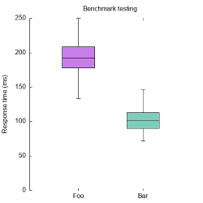
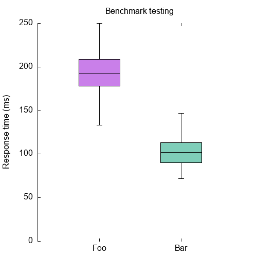

# AB runner
An opinionated Apache Benchmark (`ab`) runner and result plotter.



## Purpose

Running `ab` once can give unreliable results. Maybe your server is doing other work or your machine running the test is busy. To circumvent that issue, this script can take multiple measurements with a wait time in between.

## Contents
- [Installation](#installation)
- [Quick start](#quick-start)
- [Measure](#measure)
- [Compare](#compare)
- [Troubleshooting](#troubleshooting)

## Installation

Requirements:
- A unix terminal (tested on macOS)
- [Apache Benchmark (ab)](https://httpd.apache.org/docs/2.4/programs/ab.html)
- [Gnuplot](http://gnuplot.info/)
- [NodeJS](https://nodejs.org/en/) (>= 14.6)

To install:
- Clone this repository.
- Run `npm install`

## Quick start

```shell
./abrunner.js test --help
./abrunner.js compare --help
```

## Measure

A typical run can be started like this:
```shell
./abrunner.js test -u https://localhost.test/ -o results/foo
```

This used the default settings. It will run 10 tests of 500 requests with 10 concurrency. Between each test it will wait for 5 minutes. The results will be stored in `./results/foo`.

For more advanced options, read the [advanced test docs](./docs/test_advanced.md).

### Results

Running this command will create a bunch of outputs:
- `iteration*.dat` files contain the `ab` raw measurements
- `iteration*.out` files contain the `ab` output (that is normally outputted in the terminal)
- `combined.dat` contains all combined measurements
- `combined.stats` contain some statistics collected from the combined measurements
- `test.png` contains a plot with which you can visually inspect the response times of the individual runs and everything combined
- `test.p` is the Gnuplot script used to create above plot

## Compare

Compare any number of tests you performed before. The result will be a combined boxplot.

For each run you want to incorporate into the comparison, provide the `combined.dat` datafile (or another `ab` gnuplot output file) and an appropriate label.

```shell
./abrunner.js compare -i results/foo/combined.dat results/bar/combined.dat -l "Foo" "Bar" -o results/comparison
```

### Results

Running this command will create a bunch of outputs:
- `run*.dat` files are a copy of the input files
- `run*.stats` files contain some statistics collected from the input file
- `compare.png` contains a plot comparing all input files
- `compare.p` is the Gnuplot script used to create above plot

The comparison plot will look something like this:



## Troubleshooting

When running a new measurement, the `iteration*.out` file captures the `ab` output. Sometimes this contains an error that helps you pinpoint the problem.

If you run `ab` against a domain, make sure it ends with a `/`. If the url includes a path this should not be a problem.

The `output.log` file always contains always contains a list of the command input and all commands that were run. If somehow the input arguments are not parsed correctly, you should be able to spot that here.
